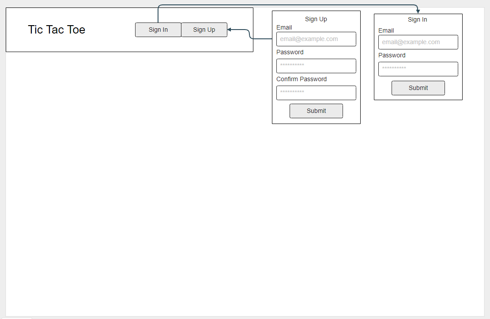
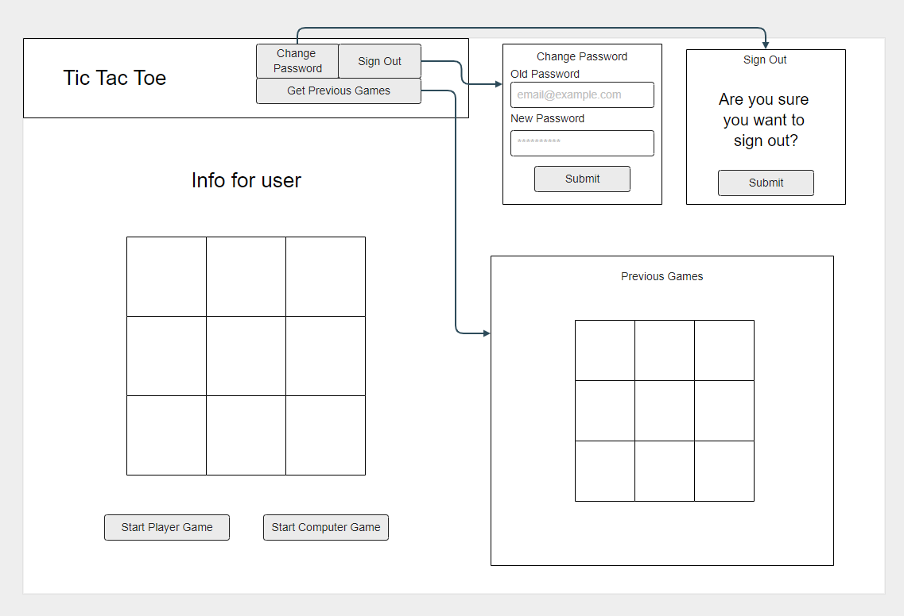

# Tic Tac Toe
This is the front end for a simple Tic Tac Toe game where you can sign up for an account and once signed in you can play an infinite amount of games. The API will keep track of all the games you've played. I've also added a computer player that will try to block you when you get 2 in a row.

### Planning
I had a pretty good idea of how to build everything. I was already familiar with the authentication process, so I just went for that. The game logic was something I hadn't encountered before, but I knew I could make it work. By using JQuery I was able to easily add and remove click listeners when needed. So that each space could only be clicked once. I also knew from the beginning that I wanted a somewhat smart computer player. The logic for it was very similar to checking for a winner, so I used the same kind of syntax, with different if checks and was able to figure it out.

### Wireframe





### User Stories
* As a user, I want to create my own account.
* As a user, I want to change my password.
* As a user, I want to start a new game.
* As a user, I want to see my previous games.
* As a user, I want to play against a computer player.

### Technologies used:
* HTML
* CSS 
* Bootstrap 
* JavaScript
* JQuery

### Problems
My problem solving involves back-tracking. If one part isn't working I start at the last function and work my way back to the source until I able to find the error. If I have an error, then I can just go straight to that line and figure it out. The biggest issue I had was the text in the boxes. At first, I couldn't get it to vertically center correctly, and then the text was going outside of the box. But I used ```overflow: hidden``` to fix it.

I have fixed all the problems that I could think of.

